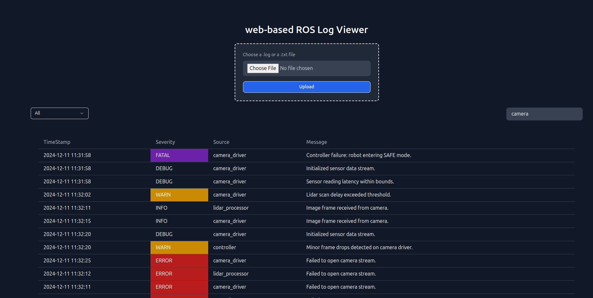

# Log Viewer and File Upload Application

This project is a React-based frontend application that provides two main functionalities:

1. **File Upload**: Users can upload a log file to the backend for processing.
2. **Log Viewer Table**: Displays log data retrieved from the backend, with options to filter by severity and search specific terms.

## Screenshot 

  
## Features

- File upload form with error handling.
- Fetch and display log data from the backend.
- Severity-based color coding in the log table:
  - **WARN**: Yellow background.
  - **ERROR**: Red background.
  - **FATAL**: Purple background.
- Filters to show logs based on severity.
- Search functionality to find specific keywords in the log messages.
- Responsive and accessible design using Tailwind CSS.

## Tech Stack

- **React**: For building the user interface.
- **TypeScript**: For type safety.
- **Tailwind CSS**: For styling.
- **Fetch API**: To communicate with the backend.

## Installation

1. Clone the repository:
   ```bash
   git clone https://github.com/mrayushmehrotra/frontend_ros
   ```

2. Navigate to the project directory:
   ```bash
   cd frontend_ros
   ```

3. Install dependencies and running the development server:
   ```bash
   npm i && npm run dev
   ```

4. Open the application in your browser at `http://localhost:5173`.

## Folder Structure

- `src/components`
  - **FileUpload**: Component for uploading files to the backend.
  - **LogTable**: Component for displaying log data in a table format with filters and search functionality.
- `src/App.tsx`: Main application file integrating components.

## Components

### FileUpload

- Accepts `handleSubmit`, `handleFileChange`, `isUploading`, and `errorMessage` as props.
- Sends the uploaded file to the backend via a POST request.

### LogTable

- Accepts `logData` as a prop.
- Displays log data in a tabular format with:
  - Timestamp
  - Severity
  - Source
  - Message
- Includes a filter and search functionality.

## Usage

### File Upload

1. Click on the "Choose File" button and select a file.
2. Press the "Upload" button to send the file to the backend.
3. If successful, the logs from the file will be displayed in the table.

### Log Table

- Use the filter dropdown to filter logs by severity.
- Enter a search term to find specific keywords in the log messages.

## API Integration

- The file upload endpoint is configured to:
  ```
  http://127.0.0.1:8000/upload_log/
  ```

- The backend should return a response with the following structure:
  ```json
  {
    "message": "File uploaded and parsed successfully",
    "log_data": [
      {
        "timestamp": "2024-12-11 11:31:58",
        "severity": "ERROR",
        "source": "controller",
        "message": "Debugging path planner outputs."
      }
    ]
  }
  ```

## Contributing

Feel free to open issues or submit pull requests for new features, bug fixes, or improvements.

## License

This project is licensed under the MIT License. See the LICENSE file for details.

---

**Author:** Ayush Mehrotra

